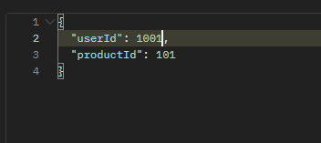
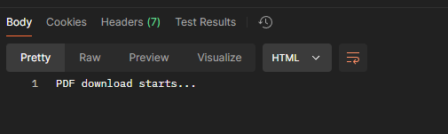

Secure PDF Download Proof of Concept
Overview
This project provides a proof of concept for securely delivering a PDF asset to users who purchase an inspection report from the platform. The main focus of the solution is to ensure that only authorized users who have purchased a report can download it, with considerations for token-based validation, user permissions, and expiration handling.

Solution Summary
The solution implements the following features:

Report Purchase:

Users can purchase a report using the /purchase-report endpoint. (Note base route is /api)
Once a purchase is made, a token is generated and returned. This token contains the user's ID, the product ID, and an expiration time (24 hours).
The token can then be used to securely download the PDF report(mock download) using the /download-pdf?token=generatedToken
Secure Download:

1. Clone the Repository
   git clone https://github.com/your-username/secure-pdf-download-poc.git
   cd secure-pdf-download
2. Install Dependencies
   Make sure you have npm installed, then run:

3. Run the server by npm start:
   This will start the server on http://localhost:3000.

4. Example Flow
   Step 1: Purchase a Report
   Send a POST request to /purchase-report with userId and productId.

   Request:
   curl -X POST http://localhost:3000/api/purchase-report \
    -H "Content-Type: application/json" \
    -d '{"userId": 1001, "productId": 101}'
   

   Response:
   {
   "token": "yourGeneratedToken"
   }

   Step 2: Download the Report
   Use the token received from the purchase request to download the report.

   Request:

   curl "http://localhost:3000/api/download-report?token=yourGeneratedToken"
   If the token is valid and the purchase is confirmed, the PDF file will be downloaded.
   

5. Unit Testing
   To run the unit tests:

   npm run test

Technologies Used
Node.js with Express: Backend framework for API handling.
TypeScript: Strong typing and safer code.
JWT: Used for token generation and validation.
npm: Package manager.
Jest: For unit testing.

Future Improvements
Real Database Integration: Integrate a real database for user, product, and order storage instead of using mock data.
File Storage: Integrate with a file storage service like AWS S3 for storing and retrieving PDF files.
Enhanced Security: Implement additional security measures, such as HTTPS, encryption of file paths, and more granular access controls.
